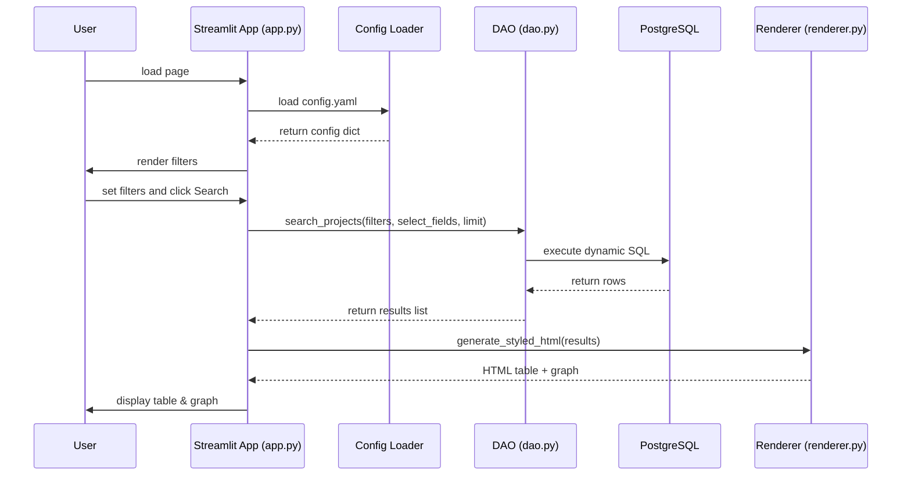

# GitHub Project Metadata Explorer

## Overview

We built this tool to help analyze and explore classroom project repositories hosted on GitHub. These are usually final projects from students, and we often want to understand what topics they worked on, which technologies they used, and how students collaborated. Instead of going through each repository manually, this tool gives us a way to collect all the relevant information and view it in a searchable, visual format.

This project uses PostgreSQL for storing data and searching through it using full-text search. We also show how students, libraries, and project topics are connected using an interactive graph.

---

## Goals and Features

- Store all project metadata in one place
- Extract project titles, team members, libraries used, and key phrases from READMEs
- Normalize and clean text for better searching
- Use PostgreSQL full-text search to quickly find relevant projects
- Let users search by keyword, year, library, or other fields defined in `config.yaml`
- Visualize connections between students and the tools they used with a network graph
- Fully configure UI and data behavior via a single `config.yaml` file

---

## Project Structure

```
project-root/
│
├── data/
│   ├── semesters.csv               # GitHub URLs to fetch forks
│   └── projects.json               # Local backup of parsed data (optional)
│
├── config.yaml                     # Main configuration for UI, fields, filters, DB, styles
│
├── app.py                          # Main Streamlit application
│
├── scripts/
│   └── generate_project_metadata.py # clone repos → parse → preprocess → load DB
│
├── project_utils/
│   ├── github_utils.py             # Clones GitHub repos using sparse checkout
│   ├── readme_parser.py            # Parses README sections based on config
│   ├── preprocess.py               # Cleans and normalizes text for indexing
│   ├── db.py                        # Database connection and raw SQL execution
│   ├── dao.py                       # DAO layer: dynamic SQL builder for filters/fields
│   ├── graph_utils.py              # Builds interactive NetworkX/PyVis graphs
│   ├── logger_setup.py             # Centralized logging for app and scripts
│   └── db_setup.sql                # SQL schema and indexes for PostgreSQL
│
└── README.md                       # This file
```

---

## How Each Part Works

1. **Clone GitHub Repos** (`scripts/generate_project_metadata.py`)
   - Reads `data/semesters.csv` from config.
   - Uses `github_utils.py` to sparse-clone only required files (`README.md`, `.py`).

2. **Parse and Extract Metadata**
   - `readme_parser.py` extracts fields defined under `extract_sections` in `config.yaml` (e.g., title, team_members).
   - `preprocess.py` normalizes text: lowercasing, stopword removal, punctuation stripping, whitespace cleanup.

3. **Load into PostgreSQL**
   - Schema defined in `project_utils/db_setup.sql`.
   - ETL script writes cleaned records and arrays (libraries) into the `projects` table.
   - A `search_vector` column uses `to_tsvector()` and a GIN index for fast full-text queries.

4. **DAO Layer** (`project_utils/dao.py`)
   - Reads `filters` and `display_columns` from `config.yaml`.
   - Builds dynamic `SELECT` clause for requested fields.
   - Builds `WHERE` clauses based on non-empty filters (keyword, year, team_members, libraries, etc.).
   - Executes SQL and returns list of dicts.

5. **Streamlit Frontend** (`app.py`)
   - Loads config via `starter_class`.
   - Renders dynamic filters (text inputs or dropdowns) based on `filters` section.
   - Calls `DAO.search_projects(...)` with `filter_inputs`, `select_fields`, `default_limit`.
   - Converts results to DataFrame and passes to `generate_styled_html()`.
   - Displays styled HTML table and interactive graph from `graph_utils.py`.

---

## Configuration (`config.yaml`)

All behavior is driven by `config.yaml`, including:

- **Database credentials** (`postgres` section)
- **Fields to display** (`display_columns` section: field, label, max_width, link, styles)
- **Filters** (`filters` section: enabled, label, field, type, options)
- **Extract sections** (`extract_sections` for README parsing)
- **UI text** (app.title, search_input_text, no_results_text, etc.)
- **Defaults** (`default_limit`, `readme_lines_to_scan`, `default_column_width`)

---

## Flow Diagram (UML Sequence)



---

## Setup & Usage

1. **Generate Metadata & Load DB**
   ```bash
   python scripts/generate_project_metadata.py --config config.yaml
   psql -U <user> -d <db> -f project_utils/db_setup.sql
   ```
2. **Run Streamlit App**
   ```bash
   streamlit run app.py
   ```
3. **Access** at `http://localhost:8501`

---

## Example Searches

- `monte carlo` (simulation)
- `queue` (queuing models)
- `pandas` (data analysis)

---

## Future Ideas

- Semantic search with embedding vectors
- CSV/Excel export of results
- Trend analysis of libraries over semesters

---
